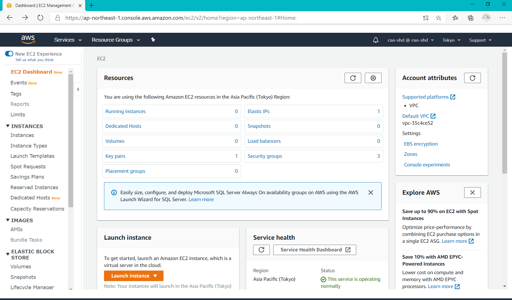
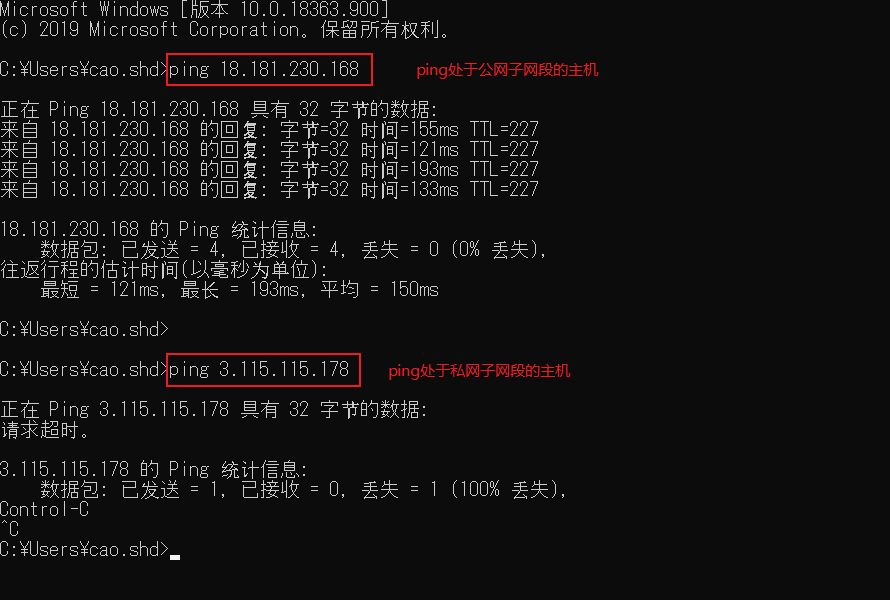

# VPC

## 地址规划

```
10.10.0.0/24  共网IP段
10.10.1.0/24  私网IP段
```

## 最终效果

1. 一个私有子网段
2. 一个共有子网段
3. 一个位于私有子网段的 ec2 机器
4. 一个位于公有子网段的 ec2 机器
5. 私有子网段内的机器不可通过外网访问
6. 公有子网段内部的机器可以通过外网访问
7. 私有子网段机器和公有网段机器都可访问外网

## 快速启动

### 进入 ```VPC``` 首页


### 创建一个```弹性IP```


### 再次进入 ```VPC``` 首页


### 创建共有子网和私有子网


### 创建```EC2```时使用```VPC```共有子网段




### 创建```EC2```时使用```VPC```私有子网段


### 测试

#### 查看机器状态


#### 测试外网访问



> 测试结果： 处于公网子网段的机器可以被外网访问， 处于私网子网段的机器不可以被外网访问。

#### 内网测试

+ 使用公网 ec2 的 IP，进入公网主机内部


+ 在公网 ec2 中，通过 ping 命令 测试 ping 私网 ec2 主机的私网 IP 地址


+ 在 cmd 控制台通过 putty 提供的pscp 命令，将密钥文件上传到外网 ec2


+ 在公网 ec2 中，修改密钥文件权限

```shell
chmod 400 <访问私网密钥文件名>
```

+ 使用密钥连接进入私网 ec2 内部

```shell
ssh -i <访问私网密钥文件名> 用户名@私网内网IP
```

+ 在私网主机中访问外网

```shell
ping www.baidu.com
```


### 说明

> 1. 本文档只是为可快速使用VPC搭建网络， 具体网络原理部分本人能力有限，无法表达清楚。😭
>
> ​       现提供如下关键词供检索学习使用：`计算机网络` 、`子网划分`、`子网掩码`、`CIDR`。
>
> 1. 注意费用问题。🙃
> 2. 上述创建VPC过程使用向导创建，向导默认的做了好多事， 具体可查看如下菜单下的详细信息。✨

